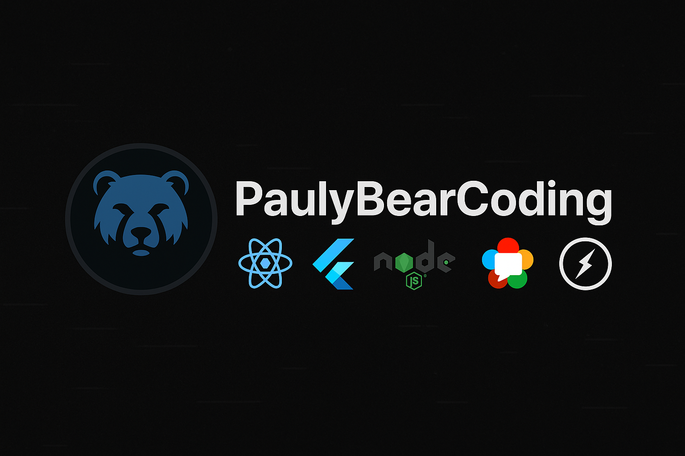

  

# 👋 Hey, I'm Paul — aka **PaulyBearCoding**

🧠 Full-Stack Engineer | Platform Architect | Real-Time App Specialist  
📍 Building secure, scalable, and beautiful platforms from the ground up.

---

## 🚧 What I'm Working On

### 🟢 **Gjyl** — A next-gen social platform  
A cross-platform experience built with modern tech to power meaningful digital connections.

**Key Features:**
- 🔊 Real-time video/audio calls (WebRTC, TURN)
- 💬 Live chat, typing indicators, and read receipts
- 🛠 Creator tools and monetization dashboard
- 📱 Flutter-powered mobile app (iOS + Android)
- 🧩 Scalable backend with Express, MongoDB, and Socket.IO
- 🔐 Security-first architecture with E2E encryption, rate-limiting, and validation layers

---

## 🧰 Quick Stack Overview

| Frontend        | Backend               | DevOps & Infra         | Realtime / Media            |
|-----------------|-----------------------|-------------------------|-----------------------------|
| React.js / Vite | Node.js + Express     | Docker, GitHub CI/CD    | WebRTC, Socket.IO, libsignal (planned) |
| Flutter (mobile)| MongoDB + Mongoose    | NGINX, Adminer (internal)| TURN/STUN, FFmpeg, Adaptive Simulcast |
| HTML/CSS/SCSS   | JWT Auth, bcrypt, Helmet.js | CI pipelines, Postman, Admin UI | Audio/video group calling, screen sharing |

---

## 🧠 Full Tech Stack

| Category      | Tools Used                                                                 |
|---------------|----------------------------------------------------------------------------|
| **Languages** | JavaScript, TypeScript, Dart, HTML, CSS                                    |
| **Frontend**  | React, Flutter, Tailwind (optional), Responsive Layouts                    |
| **Backend**   | Node.js, Express.js, MongoDB, Mongoose                                     |
| **Realtime**  | WebRTC, Socket.IO, TURN/STUN, libsignal (planned), FFmpeg                  |
| **Authentication & Security** | JWT, bcrypt, Helmet.js, input validation, CSRF protection       |
| **Media Handling** | FFmpeg, Adaptive streaming, Image optimization, Video playback UI     |
| **Testing**   | Cypress, Flutter integration_test                                          |
| **DevOps / Infra** | Docker, CI/CD pipeline, NGINX, Adminer                                 |
| **Tools**     | Git, Postman, Figma, API service layers, Custom analytics & logging        |

---

### 🧪 Testing & Security

- ✅ **Web:** Cypress end-to-end test suite  
- ✅ **Mobile:** Flutter `integration_test` coverage  
- ✅ **Security:** Password hashing (bcrypt), session tracking, rate-limiting, CSRF protection, input sanitization, validation middleware

---

## 📈 GitHub Stats

  
  

---

## 📄 Resume

📥 [Download My Resume](./Paul_Stenet_Resume.pdf)

---

## 🔒 Licensing & Ownership

This profile and my repositories reflect original work, including platform architecture, real-time media systems, and mobile-first design.

Unless otherwise noted:
- My repositories are **proprietary**
- Code is not licensed for public reuse
- See [LICENSE.md](./LICENSE.md) and [NOTICE.md](./NOTICE.md) for legal terms

---

## ✉️ Connect

- GitHub: [@PaulyBearCoding](https://github.com/PaulyBearCoding)  
- Email: paulybearcoding@gmail.com

---

> Known online as **PaulyBear** — an old nickname turned into a dev identity.
